# Implementation of network sniffer
## IPK - Project 2 
Variant ZETA - Network Sniffer

This project's assignment was to create network sniffer, that would be able to capture packets that suit specified 
filter on specified interface.

## 1. Table of contents
- [Implementation of network sniffer](#implementation-of-network-sniffer)
  * [IPK - Project 2](#ipk---project-2-)
  * [1. Table of contents](#1-table-of-contents)
  * [2. How to run it](#2-how-to-run-it)
    - [Makefile targets:](#makefile-targets)
  * [3. Basic theory for understanding the program](#3-basic-theory-for-understanding-the-program)
  * [4. Program structure](#4-program-structure)
    - [`CommandLineParser`](#-commandlineparser-)
    - [`Options`](#-options-)
    - [`ExitHandler`](#-exithandler-)
    - [`PacketData`](#-packetdata-)
    - [`Filter`](#-filter-)
    - [`PacketParser`](#-packetparser-)
    - [`OutputParser`](#-outputparser-)
    - [`PacketCapture`](#-packetcapture-)
  * [5. Testing](#5-testing)
    - [Unit tests for CommandLineParser class](#unit-tests-for-commandlineparser-class)
    - [Python integration tests](#python-integration-tests)
  * [6. Bibliography](#6-bibliography)

## 2. How to run it
The project can be build with prepared [Makefile](Makefile). The default Makefile target will create 
executable file `./ipk-sniffer` that can be started from command line as shown below:\
```
./ipk-sniffer [-i interface | --interface interface] {-p|--port-source|--port-destination port [--tcp|-t] [--udp|-u]} [--arp] [--ndp] [--icmp4] [--icmp6] [--igmp] [--mld] {-n num}
```
#### Makefile targets:
```
make        - default target, will build the executable file
make utest  - builds unit tests, and run them
make help   - prints help message of the program
make clean  - cleans binary files
```

## 3. Basic theory for understanding the program
A network sniffer is a program that captures and analyze packets transmitted over network. 
Here are some basic concepts to understanding the program:

**Packet** is formatted unit of bits carried by a packet-switched network. Packet consists of control information 
and user data (payload).

**Interface** is the connecting point between a computer and a private or public network. A network interface 
is generally a network interface card, but does not have to always have a physical form. It can also be 
implemented in software. (e.g. loopback interface)

**Network protocols and protocol subsets** defines how data are formatted, transmitted, received, 
and interpreted by network devices. 

## 4. Program structure
The structure of the program is shown in the class diagram below:



Here are some key functionalities of each class:

#### `CommandLineParser`
Class for handling user defined arguments. 

#### `Options`
All possible arguments and flags that can be set by user when running the program.

#### `ExitHandler` 
Class that handles exiting the program with specified exit code and possibly with a message 
informing user about what is happening.

#### `PacketData`
This class holds data from packet such as type of packet, MAC address, IP address, length of the frame and the payload.
In case of UDP or TCP, it also holds packet's source and destination port.

#### `Filter`
Class that creates filter, that the pcap library understands to, with options 
specified by user in arguments when running the program. However, NDP and MLD packets 
are not supported by the library's filter, so these type of packages are handled in the `PacketParser` class.

#### `PacketParser`
Class for parsing and extracting data from incoming packets. This class also handles specific types of ICMPv6 packets 
by directly checking their type.  

#### `OutputParser`
`OutputParser` formats and prints the information about captured packet in wireshark-like output.

#### `PacketCapture`
As first, `PacketCapture` gets the interface to sniff on from user defined options. Then it sets the filter created 
by the `Filter` class and starts capturing packets on the specified interface until the packet count (default 1) set 
by user is captured or user exits the program by pressing `Ctrl+C`. When a packet is captured, it prints out interesting 
information about the packet to stdout with the `OutputParser` class.

## 5. Testing
This section is about verifying functionality of the program as a whole and also its components.

#### Unit tests for CommandLineParser class
Module for parsing arguments specified by user was tested by unit tests using `Xunit` and can be found 
in [src/NetworkSniffer.Tests/](./src/NetworkSniffer.Tests/CommandLineParserTests.cs).

#### Python integration tests
The application as a whole was tested by my tests written in python using `Scapy` library. 
This library allowed me to easily create and send packets of different types. Values that are being checked in the tests
were gathered from sending the packets and checked in `wireshark` and `tshark`. There are basic tests for each type of 
packet with some basic filtering, but also advanced tests, for example advanced filters and catching multiple packages.
These tests can be found in the gitea repository in [src/NetworkSniffer.Tests/](./src/NetworkSniffer.Tests/tests.py).
The tests can be run with:
```
sudo python3 tests.py
```
And specific test cases like this:
```
sudo python3 tests.py TestIPKSniffer.test_case_name
```
There can be also specified optional argument `-d`, that will turn on the debugging mode and prints the output of the program and `-h` that prints a simple help message.

Here is example of running `sudo python3 tests.py`.

```
.
.
.
========================================================================
test_tcp:
.
Sent 1 packets.
Test passed.
========================================================================
.
========================================================================
test_tcp_or_udp:
.
Sent 1 packets.
.
Sent 1 packets.
Test passed.
========================================================================
.
========================================================================
test_udp:
.
Sent 1 packets.
Test passed.
========================================================================
.
----------------------------------------------------------------------
Ran 20 tests in 64.133s

OK
```

Example of running specific test case (testcase test_tcp):
```
========================================================================
test_tcp:
.
Sent 1 packets.
Test passed.
========================================================================
.
----------------------------------------------------------------------
Ran 1 test in 1.377s

OK
```
Same test case that has been ran with `-d` argument:
```
$ sudo python3 tests.py TestIPKSniffer.test_tcp -d

========================================================================
test_tcp:
.
Sent 1 packets.
Tcp
--------------------------------------------
timestamp: 2024-04-22T17:48:02.510+02:00
src MAC: 00:00:00:00:00:00
dst MAC: ff:ff:ff:ff:ff:ff
frame length: 66 bytes
src IP: 127.0.0.1
dst IP: 127.0.0.1
src port: 20
dst port: 80

0x0010: ff ff ff ff ff ff 00 00  00 00 00 00 08 00 45 00 ........ ......E.
0x0020: 00 34 00 01 00 00 40 06  7c c1 7f 00 00 01 7f 00 .4....@. |.......
0x0030: 00 01 00 14 00 50 00 00  00 00 00 00 00 00 50 02 .....P.. ......P.
0x0040: 20 00 3f 75 00 00 48 65  6c 6c 6f 2c 57 6f 72 6c  .?u..He llo,Worl
0x0050: 64 21                                            d!
--------------------------------------------

Packet count reached. Exiting...
Test passed.
========================================================================
.
----------------------------------------------------------------------
Ran 1 test in 1.326s

OK
```


## 6. Bibliography
[SharpPcap Tutorial] Tutorial for SharpPcap [online]. [cited 2024-04-21]. Available at: https://github.com/dotpcap/sharppcap/tree/master/Tutorial

[SharpPcap Examples] Examples of SharpPcap [online]. [cited 2024-04-21]. Available at: https://github.com/dotpcap/sharppcap/blob/master/Examples

[Ndp] Wireshark/ICMPv6 NDP [online]. [cited 2024-04-21]. Available at: https://en.wikiversity.org/wiki/Wireshark/ICMPv6_NDP

[Tcpdump] Tcpdump Manual Pages [online]. [cited 2024-04-21]. Available at: https://www.tcpdump.org/manpages/pcap-filter.7.html

[Stallings] Stallings, William (2001). "Glossary". *Business Data Communication* (4th ed.). Upper Saddle River, New Jersey, USA: Prentice-Hall, Inc. p. 632. ISBN 0-13-088263-1. Available at: https://archive.org/details/businessdatacomm00stal/page/632

[Network Interface] Oracle Java Tutorials: Network Interface [online]. [cited 2024-04-21]. Available at: https://docs.oracle.com/javase/tutorial/networking/nifs/definition.html

[RFC792] Postel, J. _INTERNET CONTROL MESSAGE PROTOCOL_ [online]. September 1981. [cited 2024-04-21]. Updates: RFCs 777, 760. Updates: IENs 109, 128. Available at: https://datatracker.ietf.org/doc/html/rfc792

[RFC826] Plummer, D.C. _An Ethernet Address Resolution Protocol_ [online].  November 1982. [cited 2024-04-21]. Available at: https://datatracker.ietf.org/doc/html/rfc826

[RFC5952] Kawamura, S. and Kawashima, M. _A Recommendation for IPv6 Address Text Representation_ [online]. August 2010. [cited 2024-04-21]. Available at: https://datatracker.ietf.org/doc/html/rfc5952

[RFC3339] Klyne, G. and Newman, C. _Date and Time on the Internet: Timestamps_ [online]. July 2002.  [cited 2024-04-21]. Available at: https://datatracker.ietf.org/doc/html/rfc3339

[Wikipedia, the free encyclopedia.] _Neighbor Discovery Protocol_ [online]. [cited 2024-04-21]. Available at: https://en.wikipedia.org/wiki/Neighbor_Discovery_Protocol
